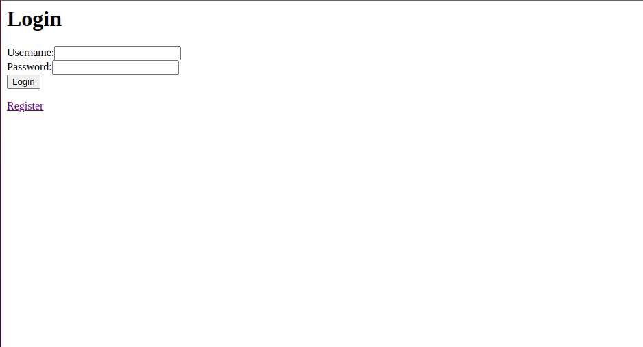
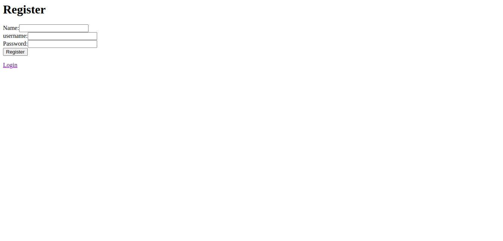
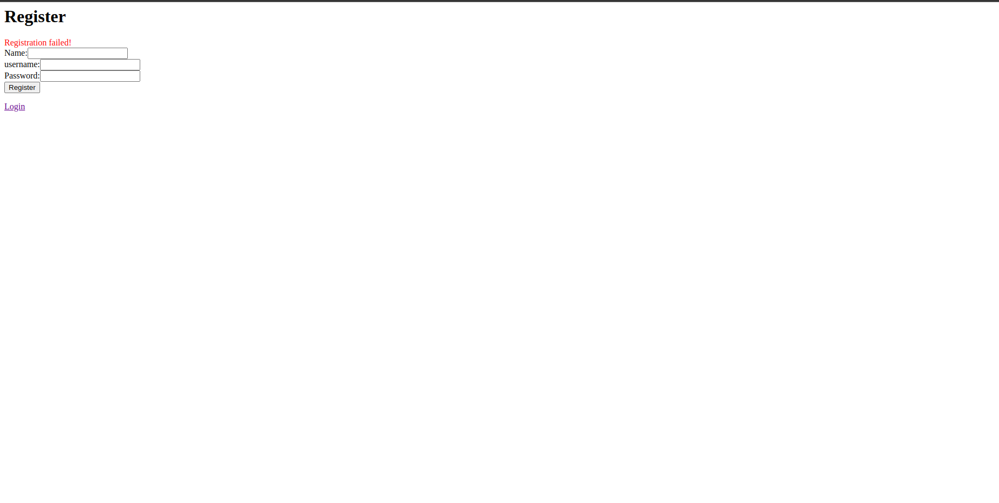
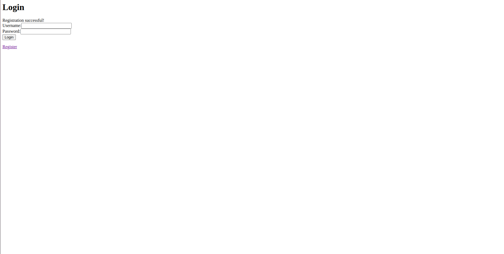

# NodeChat
A Chat application written in Nodejs.

## Table of Contents
- [General Info](#general-info)
- [Technologies](#technologies)
- [Prerequisite](#prerequisite)
- [Setup](#setup)
- [Example](#example)

## General Info
This is a chat app written in Nodejs, ExpressJS, Socket.io, Mongoose and other modules. You can register, login and chat with other people
## Technologies
- Node.js v20.13.1
- Express v4.16.1
- Socket.io v4.7.5
- MongoDB v6.7.0
- .....
## Prerequisite
You should install [Nodejs](https://nodejs.org/en/download/package-manager) and [npm](https://docs.npmjs.com/downloading-and-installing-node-js-and-npm) for running this project.
## Setup
To run this project, clone it using the following commands and then start the server:
```bash
$ git clone [URL above]
$ npm install  
$ npm run devStart
```
## Example
```bash
$ npm run devStart
```
Go to `localhost:8080/login`, you will see web page that is similar with the one below

If I don't have an account, you can sign up at `localhost:8080/register` or click on `Register` button on the login page.

A notification will be sent if you sign up failed.

Otherwise, it will like this

